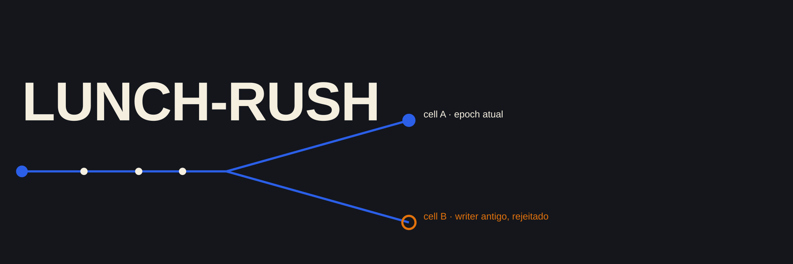

<p align="center">
  
  
  
  
</p>

Diferente de uma coleção de microprojetos independentes, é um sistema só: todo o
código pertence ao mesmo domínio e evolui tier por tier no mesmo repositório, sem
reescrever o anterior. O roadmap está fechado no tier 6.

## Tiers

- **[Tier 1 · monólito modular](./docs/passo-a-passo/tier-1.md)**. Núcleo em Go
  com PostgreSQL, idempotência e disputa concorrente por entregador: 20
  tentativas simultâneas pelo mesmo entregador produzem exatamente 1 vencedora.
- **[Tier 2 · tracking e resiliência local](./docs/passo-a-passo/tier-2.md)**.
  GPS via Redis, autenticação e rate limit sobre o mesmo monólito: o Redis fora
  do ar não derruba leitura nenhuma, cai direto para o PostgreSQL.
- **[Tier 3 · distribuído com Kafka](./docs/passo-a-passo/tier-3.md)**. Quebra
  o monólito em serviços comunicando por outbox/inbox: um crash simulado entre
  publicar e confirmar republica a mensagem, mas o inbox deduplica o efeito.
- **[Tier 4 · "AWS" simulada e supply chain](./docs/passo-a-passo/tier-4.md)**.
  Terraform contra LocalStack, Helm, KEDA e SBOM assinado: o KEDA escala de 0 a
  6 réplicas por lag real de consumer group, sem conta AWS paga envolvida.
- **[Tier 5 · arquitetura celular e TLA+](./docs/passo-a-passo/tier-5.md)**.
  Divide o sistema em células com fencing por epoch/lease, verificado
  formalmente: 0 violação em 1086 estados do TLC, 20 tentativas com epoch
  velho e 0 sucessos.
- **[Tier 6 · portabilidade entre provedores](./docs/passo-a-passo/tier-6.md)**.
  Mesmo artefato rodando em dois "provedores" simulados, com failover de
  fencing entre eles: RTO de 11,54s, writer antigo rejeitado em 10 de 10
  tentativas.

A ordem é a evolução real do sistema, não uma sugestão de leitura: cada tier
assume o anterior. O passo a passo de cada um, com o que esperar em cada
comando, está no link acima; os números completos ficam em `docs/benchmarks/`.

## Como executar

```bash
git clone https://github.com/matheusgb/lunch-rush.git
cd lunch-rush
docker compose --profile app --profile observability up -d --build
```

Sobe PostgreSQL, Redis, Redpanda, os cinco serviços do domínio, Prometheus e
Grafana (`http://localhost:3000`). Portas fora do padrão (`8083`, `8084`,
`8085`, `8092`) evitam colidir com outro laboratório já rodando no mesmo host.

```bash
make test              # unitários
make test-race         # com o detector de corrida
make test-integration  # requer Postgres, Redis e Redpanda locais, já migrados
```

Do tier 4 em diante o sistema depende de infraestrutura adicional: Kubernetes
via `kind`, LocalStack, TLA+, arquitetura celular, segundo provedor simulado.
Os comandos exatos de cada um estão em `docs/passo-a-passo/tier-N.md`.

## Limites

O lunch-rush prova correção sob concorrência, entrega distribuída com efeito
deduplicado, um protocolo de fencing verificado formalmente em TLA+ e a
sobrevivência desse protocolo a uma troca de "provedor", com RTO/RPO medidos
localmente.

Não prova operação real em produção, alta disponibilidade entre regiões AWS
reais, nem independência de dois provedores de nuvem pagos de verdade. Toda
peça do roadmap original que dependia disso foi substituída por simulação
local, documentada tier a tier em `docs/limitacoes-simulacao-local.md`.
